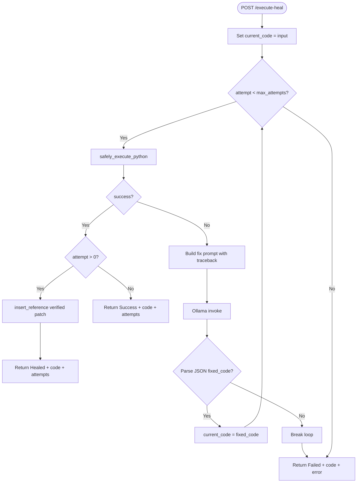

# Smart Code Library — Self-Healing Flow

How the `heal_and_verify` loop works, what gets stored in the vector database, and when healing succeeds or fails.

Aligned with **Janus SOUL.md §6** (Self-Repair Contract): verified heals seed memory; unverified fixes do not.

---

## Overview

The **SelfHealingSandbox** (`sandbox/code_runner.py`) executes user-submitted Python code. If execution fails, it uses a local Ollama model (`qwen2.5-coder:7b` by default) to generate fixes, retries execution, and persists **verified** patches to the vector memory for future retrieval.

Entry point: `POST /execute-heal` → `sandbox.heal_and_verify(code)`

**Janus integration:**

| Janus component | Smart-Library endpoint | Purpose |
|-----------------|------------------------|---------|
| `MemoryClient.queryContextSlices()` | `POST /query/context` | Token-efficient retrieval for executor briefs (no LLM call) |
| `MemoryClient.heal()` | `POST /execute-heal` | Sandboxed execution + verified heal write-back |
| `janus doctrine seed` | `POST /seed` | Bootstrap SOUL.md as `Operational Doctrine` |

Executor briefs use `/query/context` (capped slices per `token_policy.memory_slice_max_chars`) instead of `/query`, which invokes the LLM. This matches SOUL §3 token policy.

---

## Flow Diagram



---

## Step-by-Step

### 1. Initial Execution

`safely_execute_python(code_string)` (default: Docker-isolated):

- When `USE_DOCKER_SANDBOX` is not `false`, runs code in an ephemeral `python:3.11-slim` container via `execute_in_docker`
- Container constraints: `--network none`, `--memory 128m`, `--cpus 0.5`, read-only rootfs, code via stdin
- Falls back to in-process `exec()` only when Docker is unavailable or `USE_DOCKER_SANDBOX=false`
- Captures stdout and exception tracebacks from the container or in-process runner
- Returns:

```python
{
    "success": bool,
    "stdout": str,
    "error_traceback": str | None
}
```

### 2. Success Path

If `success` is `True` on any attempt:

**First attempt (no prior heal):**

```python
{
    "status": "Success",
    "code": current_code,
    "attempts": 1,
    "stdout": "..."
}
```

**After at least one heal retry (`attempt > 0`):**

```python
{
    "status": "Healed",
    "code": current_code,      # fixed version that passed verification
    "attempts": attempt + 1,
    "stdout": "..."
}
```

### 3. Failure Path — LLM Fix

On execution failure, the sandbox sends a prompt to the local Ollama LLM:

```
Fix this code. Return a valid JSON dictionary string containing keys: 'fixed_code' and 'explanation'.

Code to fix:
{current_code}

Error Details:
{error_traceback}
```

Expected LLM response format:

```json
{
  "fixed_code": "...",
  "explanation": "..."
}
```

### 4. Vector DB Write-Back (Post-Verification Only)

Patches are **not** stored when the LLM returns a fix. Storage happens only when the **next execution succeeds** and `attempt > 0`:

```python
if attempt > 0 and last_fix_explanation and last_error_traceback:
    db.insert_reference(
        content=f"Fixed error: {last_error_traceback}. Fix: {last_fix_explanation}",
        category="Self-Healing Patch"
    )
```

| Stored Field | Value |
|--------------|-------|
| `page_content` | Error traceback + human-readable fix explanation |
| `metadata.category` | `"Self-Healing Patch"` |
| `metadata.language` | `"All"` (default) |

These entries enrich `/query` and `/query/context` results so similar errors can be resolved from past **verified** fixes.

### 5. Retry Loop

- `current_code` is updated to `fixed_code`
- `last_error_traceback` and `last_fix_explanation` are retained for write-back on the next success
- Loop continues until success or limits are hit
- Failed intermediate fixes are never written to memory

### 6. Terminal Failure

If all attempts fail or LLM output cannot be parsed:

```python
{
    "status": "Failed",
    "code": current_code,        # last attempted fix, or original if no parse
    "error": result["error_traceback"],
    "attempts": max_attempts     # or attempt count on parse_error
}
```

---

## Configuration

| Parameter | Default | Location |
|-----------|---------|----------|
| `max_attempts` | **3** | `heal_and_verify(broken_code, max_attempts=3)` |
| `USE_DOCKER_SANDBOX` | **true** | `.env` / environment; set `false` for in-process `exec()` only |
| Docker execution timeout | **30s** | `safely_execute_python(..., timeout=30)` |
| LLM model | `qwen2.5-coder:7b` (local) | `ChatOllama` via Ollama — no API key |
| LLM temperature | `0` | Deterministic fix generation |

---

## Attempt Budget Example

| Attempt | Action | Stored? |
|---------|--------|---------|
| 1 | Run original code | Fails → LLM fix → **no store** |
| 2 | Run fixed code v1 | Fails → LLM fix → **no store** |
| 3 | Run fixed code v2 | Succeeds → **store patch** → return `Healed`, `attempts: 3` |

Maximum **3 executions** per request (not 3 LLM calls after success).

---

## What Gets Stored vs What Does Not

| Event | Stored in Vector DB? |
|-------|----------------------|
| Verified heal after retry (`attempt > 0`) | **Yes** — patch + explanation |
| First-attempt success (no error) | **No** |
| LLM fix proposed but not yet re-executed | **No** |
| Intermediate fix that still fails on retry | **No** |
| Failed heal (all attempts exhausted) | **No** |
| LLM parse failure (invalid JSON) | **No** — loop breaks immediately |

This enforces SOUL §6 and anti-pattern **"Seeding unverified heals to memory"** (SOUL §8).

---

## Security Considerations

- Default sandbox runs user code in ephemeral Docker containers (`execute_in_docker`) with no network, memory/CPU limits, and read-only root filesystem
- `docker-compose.yml` mounts the Docker socket into `api_server` so it can spawn sandbox containers; this grants significant host control — restrict API access in production
- In-process `exec()` fallback is used only when Docker is unavailable or `USE_DOCKER_SANDBOX=false` (dev/trusted use)
- Docker execution enforces a **30s** timeout per run; in-process fallback has no timeout

---

## Related Endpoints

- **`POST /execute-heal`** — Triggers this flow
- **`POST /query/context`** — Janus token-efficient retrieval (no LLM); used by `MemoryClient.queryContextSlices()`
- **`POST /query`** — Full retrieval + LLM synthesis; avoid for executor briefs
- **`POST /seed`** — Manual alternative to populate fixes without execution